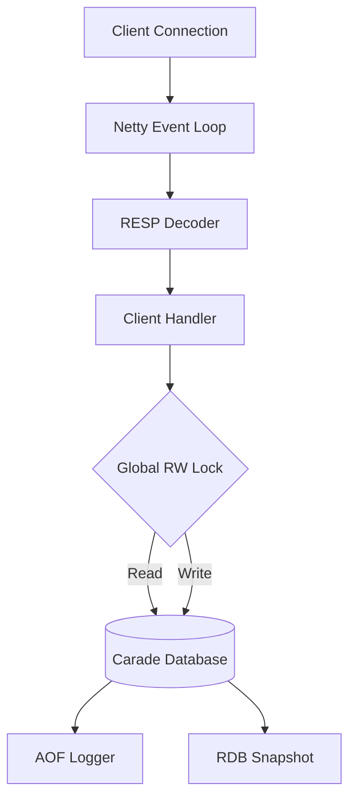

# System Architecture

Carade is designed as a high-performance, single-process, multi-threaded server. While it draws inspiration from Redis's single-threaded event loop model, Carade leverages the Java Virtual Machine's strengths and the Netty framework to achieve concurrent I/O handling with a serialized write path.

## High-Level Diagram

## Threading Model: "Hybrid I/O + Serialized Writes"

Carade employs a hybrid threading model:

1.  **Network I/O (Multi-threaded):**
    *   Incoming connections are handled by Netty's `NioEventLoopGroup`.
    *   Reading from sockets, decoding the RESP protocol, and writing responses back to clients are fully asynchronous and parallelized across available CPU cores.

2.  **Command Execution (Serialized Writes):**
    *   To maintain data consistency without complex fine-grained locking, write operations are serialized using a global `ReentrantReadWriteLock` (`Carade.globalRWLock`).
    *   **Read Operations:** Can proceed concurrently if no write lock is held.
    *   **Write Operations:** Require exclusive access, blocking other reads and writes.

This approach simplifies the implementation of atomic commands (like `INCR`, `LPOP`) while still benefiting from multi-threaded I/O processing.

## Memory Management

*   **Heap Storage:** All data resides in the JVM Heap.
*   **Database Structure:** Data is partitioned into logical databases (default 16), implemented as an array of `ConcurrentHashMap<String, ValueEntry>`.
*   **Eviction:** When `maxmemory` is reached, Carade triggers an eviction policy (e.g., `volatile-lru`, `allkeys-lru`) to free space.
*   **Expiration:** Keys with a TTL are removed lazily (on access) and actively via a background "Janitor" thread.

## The "Janitor" Thread

A dedicated background thread (ScheduledExecutor) performs maintenance tasks:
*   **Active Expiration:** Randomly samples keys with expiration times and removes them if expired.
*   **Snapshotting:** Triggers periodic RDB saves based on configuration.
*   **Cleanup:** Removes stale cursors from `SCAN` operations.
